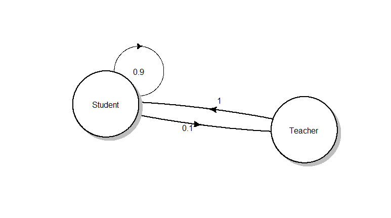

<!----
Customised theme
Colour scheme from: https://color.adobe.com/Birdfolio-Blues-color-theme-1945976/
--->

<style>
em {
  font-style: italic
}


strong {
  font-weight: bold;
}


.title-slide {
  background-color: #EFEFEF; /*#CBE7A5;  #EDE0CF; ; #CA9F9D*/
}

.title-slide hgroup > h1{
 font-family: 'Oswald', 'Helvetica', sanserif; 
}

.title-slide hgroup > h1, 
.title-slide hgroup > h2 {
  color: #FF530D   /*#535E43; #EF5150*/
}

/*Change the table colours */
table th {
  background: #BDD4DE;
  color: #3F5765;
}

table tr:nth-child(2n+1) {
/*  background: #E8F2FF; */
  background: #FFFFFF;
}


slide.codefont pre {
font-size: 14px ;
}

/*
slides > slide {
  background: #EFEFEF !important;
}
*/
</style>


## Overview

0. Front matter
1. Motivating example
2. Introducing Plotly
3. WOWs & WOEs

--- .class #id 
## Introduction and Objective

- Introduction
  - Engineer in signal processing
  - Worked in forecasting (financial, energy, propensity)
  - Now working in Hitwise (predictive modelling)

- Objective
  - A good idea where Plotly  might be beneficial for exploratory data analysis
  - Some interesting facts about the NY Philharmonic Orchestra

---
## Disclaimer
<div style='text-align: center;'>
    
</div>

- No affiliation with Plotly
- Developed with R+RStudio environment (Viewer pane)

---
## Motivating Example 
The (simplified) exploratory data analysis process:

```{r, eval=FALSE}
rawData <- get_data_from_somewhere(dataSource)   # dataSource = SQL/csv/MapReduce
 
while (i_have_found_something = FALSE){
  cleanedData <- clean_data(rawData)        # yuck
  df <- do_other_stuff(cleanedData)         # transform, model, summarise
  insights <- visualise(df)                 # look at the pretty colours
  
  if (insights > significant_value){
    ## EUREKA!!!
    i_have_found_something = TRUE
  }
}
```

---
## NY Philharmonic Orchestra
- NY Philharmonic Orchestra's performance history from December 1842
- Publicly available on [github](https://github.com/nyphilarchive/PerformanceHistory)
- Extracted (from XML) composer, date, location and programID

```{r, echo=FALSE}
load("~/Documents/analytics/plotlyPresentation_MelbURN/data/plotDf.RData")
head(plotDf, 8)
```

---
## Explore: Summary

```{r, echo=FALSE}
str(plotDf)
summary(plotDf)
```

>- How has the number of performances trended over time?
>- Who are the composers with the highest number of performances?


---
## Explore: Visuals - Time Trend
Simple time-series with loess fit:

```{r, echo=FALSE, message=FALSE, warning=FALSE, fig.height=5, fig.width=14, fig.align='center'}
library(lubridate)
library(dplyr)
library(ggplot2)
library(viridis)
theme_set(theme_bw())
load("~/Documents/analytics/plotlyPresentation_MelbURN/data/performanceData.RData")
nPerfByYear <- performanceData %>%
  filter(!is.na(composerName)) %>%
  mutate(date.yr = round_date(date, "year")) %>%
  group_by(date.yr) %>%
  summarise(nPerf = length(unique(programID)))

ggplot(nPerfByYear, aes(x = date.yr, y = nPerf)) +
  geom_line() + 
  theme_bw() +
  stat_smooth() +
  ggtitle("NY Philharmonic Performances") +
  ylab("Number of Performances") +
  xlab("Year")
```

- *What year does performances pick up?*
- *What was the maximum number of performances ever done in a single year?*

---
## Explore: Visual - Top N Most Performed Composers
Ordered scatter type plot:

```{r, echo=FALSE, message=FALSE,  fig.height=5, fig.width=14, fig.align='center'}
load("~/Documents/analytics/plotlyPresentation_MelbURN/data/plotDf.RData")

countsByComposer <- plotDf %>%
  filter(composer != "") %>%
  group_by(composer) %>%
  summarise(nPerf = n()) %>%
  arrange(desc(nPerf)) %>%
  mutate(rank = seq(1, n()))

n <-  50
ggplot(countsByComposer[1:n, ],
       aes(x = reorder(composer, -nPerf), y = nPerf)) +
  geom_point(aes(colour = rank)) +
  scale_color_viridis() +
  theme_bw() +
  theme(axis.text.x = element_text(angle = 90, hjust = 1),
        axis.title.x=element_blank()) +
  ggtitle(paste0("Top ", n, " Composers By Performances")) +
  ylab("Number of performances")
```

- *How many times has a work by Rachmaninov been performed?*
- *What's the difference in rank between Stravinsky and Rimsky-Korsakov?*

---
## I wish I could...
- Get a good looking plot without a lot of code 
- Interact with my data

---
## Introducing Plotly: Time series
<iframe src="./assets/widgets/plotly_perfByYear.html" 
        height='75%' width="100%">
</iframe>

```{r, echo=FALSE, eval=FALSE}
# Code for plotly plot
# p <- plot_ly(nPerfByYear,
#              x = date.yr,
#              y = nPerf,
#              name = "Total Performances")
# fitted.val <- fitted(loess(nPerf ~ lubridate::year(date.yr), data = nPerfByYear))
# p <- p %>% add_trace(y = fitted.val, x = date.yr, name = "Loess Fit")
# 

```

---
## Introducing Plotly: Top Composers
<iframe src="./assets/widgets/plotly_topComposers.html" 
        height='75%' width="100%">
</iframe>

```{r, eval=FALSE, echo=FALSE}
# Code for plotly plot above
# n <- 50
# pComposers <- plot_ly(countsByComposer[1:n, ], x = composer, y = nPerf,
#         color = rank,
#         text = paste("Rank: ", rank),
#         mode = "markers")
# pComposers
```

---
## More formally
- What is it?
   - "*Built on top of d3.js and stack.gl, plotly.js is a high-level, 
   declarative charting library. plotly.js ships with 20 chart types, 
   including 3D charts, statistical graphs, and SVG maps.*"
[See link](https://github.com/plotly/plotly.js)
   - open source
   - API's to R, Python, Matlab

- plotly package for R
   - *Plotly for R is an interactive, browser-based charting library built on 
   the open source JavaScript graphing library, plotly.js. It works entirely 
   locally, through the HTML widgets framework.*

---
## Goodbye Hadley...we're breaking up
- How does this compare to ggplot2?
- Do we really need both?

>- ***It depends...***

--- .codefont
## Code comparison - Time series

```{r, eval = FALSE}
# ggplot way
ggplot(nPerfByYear, aes(x = date.yr, y = nPerf)) +
  geom_line() + 
  theme_bw() +
  stat_smooth() +
  ggtitle("NY Philharmonic Performances") +
  ylab("Number of Performances") +
  xlab("Year")

# plotly
p <- plot_ly(nPerfByYear,
             x = date.yr,
             y = nPerf,
             name = "Total Performances")
fitted.val <- fitted(loess(nPerf ~ lubridate::year(date.yr), data = nPerfByYear))
p <- p %>% add_trace(y = fitted.val, x = date.yr, name = "Loess Fit")

```

- ggplot's *stat_smooth* makes it a bit easier to put in trend lines with error bands
- plotly likes *%>%* 

--- .codefont
## Code comparison - Ordered scatter plot

```{r, eval = FALSE}
# ggplot way
n <-  50
ggplot(countsByComposer[1:n, ],
       aes(x = reorder(composer, -nPerf), y = nPerf)) +
  geom_point(aes(colour = rank)) +
  scale_color_viridis() +
  theme_bw() +
  theme(axis.text.x = element_text(angle = 90, hjust = 1),
        axis.title.x=element_blank()) +
  ggtitle(paste0("Top ", n, " Composers By Performances")) +
  ylab("Number of performances")


# plotly
pComposers <- plot_ly(countsByComposer[1:n, ], x = composer, y = nPerf,
        color = rank,
        text = paste("Rank: ", rank),
        mode = "markers")
pComposers

```

- ggplot required a few more steps to get it looking like plotly

--- .codefont
## ggplotly: The best of both worlds
You can also convert a ggplot object directly to a plotly one with `ggplotly`


```{r, eval=FALSE}
# Summarise data
tmpDf <- plotDf.sum %>%
  filter(composer %in% countsByComposer$composer[1:12])

tmpDf$composer.f <- factor(tmpDf$composer, 
                           levels = countsByComposer$composer[1:12])

# Define my own coloursheme (from colorbrewer.org)
colorScheme = c('#a6cee3','#1f78b4','#b2df8a','#33a02c',
                '#fb9a99','#e31a1c','#fdbf6f','#ff7f00',
                '#cab2d6','#6a3d9a','#ffff99','#b15928')

# do a facet plot of time series for each composer
pFacet <- ggplot(tmpDf, aes(x = date.yr, y = nPerf)) +
  geom_line(aes(colour = composer)) + 
  facet_wrap(~composer.f) +
  theme_bw() + 
  ggtitle("NY Philharmonic Performances") +
  ylab("Number of Performances") +  xlab("Year") +
  scale_color_manual(values = colorScheme) +
  theme(legend.position="none")

ggplotly(pFacet)

```

---
## ggplotly (cont'd)
<iframe src="./assets/widgets/plotly_timeSeriesByComposer.html" 
        height='75%' width="100%">
</iframe>

---
## Other features worth noting -- 3D plots
<iframe src="./assets/widgets/plotly_timeSeriesByComposer_3D.html" 
        height='75%' width="100%">
</iframe>

---
## Other features worth noting -- Maps
<iframe src="./assets/widgets/plotly_nPerf_Map.html" 
        height='75%' width="100%">
</iframe>

--- .codefont
## Map Plot

```{r, eval=FALSE}
# marker styling
m <- list(
  colorbar = list(title = "Number of Performances (log)"),
  size = 8, opacity = 0.8, symbol = 'square'
)

# geo styling
g <- list(
  projection = list(type = 'natural earth'),
  showcountries = TRUE, 
  showland = TRUE,
  landcolor = toRGB("gray95"),
  subunitcolor = toRGB("gray85"),
  countrycolor = toRGB("gray85"),
  countrywidth = 0.5,
  subunitwidth = 1
)

pMap <- plot_ly(locationSummary, lat = lat, lon = lon, text = hoverText, color = nPerf.log,
        type = 'scattergeo', mode = 'markers') %>%
  layout(title = 'NY Philharmonic Performances', geo = g)

```

---
## Sharing 
- Online via [plot.ly](https://plot.ly)
- As widgets + iframes

```{r, eval = FALSE}
# plot the top n
n <- 50
pComposers <- plot_ly(countsByComposer[1:n, ], x = composer, y = nPerf,
        color = rank,
        text = paste("Rank: ", rank),
        mode = "markers")
pComposers
pComposerFid <- "plotly_topComposers.html"
htmlwidgets::saveWidget(as.widget(pComposers), pComposerFid)
```

```
<iframe src="plotly_topComposers.html" 
        height='75%' width="100%">
</iframe>
```

---
## Other types of charts
- Heatmaps
- Bar charts
- Statistical plots (boxplots, histograms)
- Even pie charts!! 
- Polar charts
- etc, etc, etc...

---
## Summary: WOWs
- Interactivity is wonderful
- Plotly defaults are pretty nice $\rightarrow$ not too much work for something 
aesthetically very pleasing
- One package with lots of versatility (3D surface, heatmaps, etc...)
- `ggplotly` bridges ggplot and plotly
- Multiple API's mean you can have various languages with consistent looking plots 


---
## Summary: WOEs
   - Syntax is not like the grammar of graphics, but pretty good
   - Does crash from time to time (not sure why)
   - ggplotly works pretty well usually, but can have issues with many facets or
   lots of `aes` features $\rightarrow$ do you really need to facet so much?
   - Web based, so sharing in traditional outlets (print, reports etc) is a bit more tricky


---
## Questions?
Thanks.

---
## References
- [Plot.ly (Getting started)](https://plot.ly/r/getting-started/)
- [Plot.ly R Reference](https://plot.ly/r/reference/)
- [Plotly Blog](http://moderndata.plot.ly/about/)
- [NY Philharmonic Performance Data](https://github.com/nyphilarchive/PerformanceHistory)
- [R & py scripts for getting the NY Philharmonic Data](https://github.com/jiunsiew/NY_Philarchive_performanceHistory)
- [Code for this presentation](https://github.com/jiunsiew/plotly_presentation)
